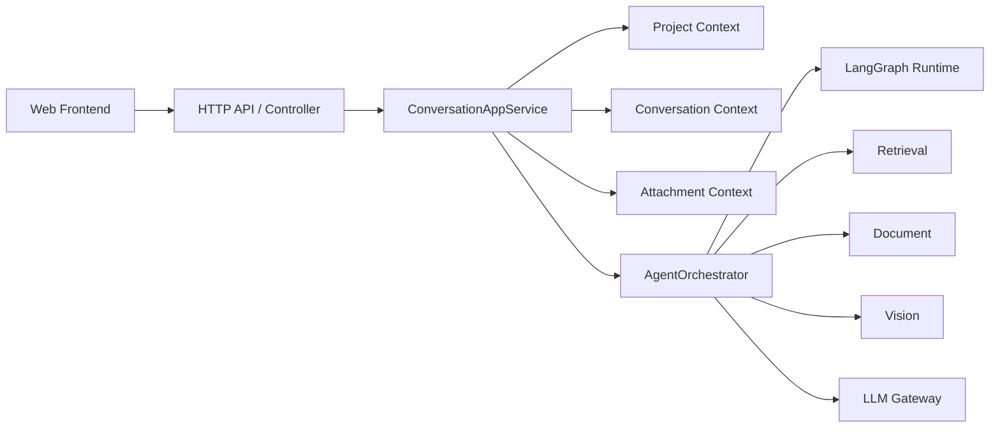
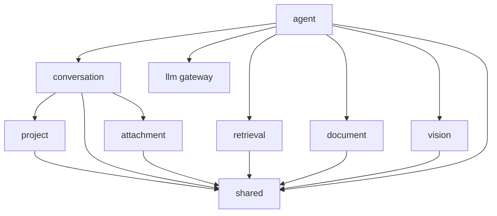

# qwen-demo 架构设计文档

## 1. 设计目标

本项目的架构设计目标不是追求“大而全”，而是在面试项目的约束下做到：

- 结构清晰，便于讲解
- 能支撑后续功能逐步扩展
- 前后端职责边界明确
- 外部能力可替换，降低后续调整成本
- 在不过度设计的前提下体现良好的设计原则

## 2. 核心决策

### 2.1 总体形态

当前建议采用：

- 前端：单独 Web 应用
- 后端：单独 API 服务
- 部署方式：本地运行
- 后端形态：模块化单体
- 架构风格：轻量 DDD + 端口适配器架构

这里的“模块化单体”指：

- 代码按领域和职责分模块组织
- 模块之间通过明确接口协作
- 部署时仍是一个后端进程

这样做的优点是：

- 第一阶段实现成本低
- 调试简单
- 便于快速迭代
- 后续若需要拆分服务，也有清晰的边界可参考

### 2.2 为什么这样设计

参考项目：`/Users/bytedance/Documents/harness/deepseek-harness-master`

借鉴它的三点思路：

- 模块边界清晰
- 能力通过接口和适配层解耦
- 新功能以组合和扩展方式接入，而不是直接侵入核心流程

但本项目不直接照搬其插件化平台架构，原因是：

- 参考项目更像通用 AI Harness 平台
- 当前项目是面向面试展示的单一业务 Demo
- 若一开始引入过重的插件系统，会增加实现成本和讲解成本

### 2.3 关于 Agent 的决策

这里需要明确三点：

- `agent` 是业务上的独立模块和架构边界
- 但 Agent Runtime 不建议手搓
- 当前方案采用 `LangGraph` 承载多步状态流转、条件分支和工具调用循环

因此，系统里要区分两类编排：

- 会话编排：处理 `SendMessage` 这种请求级主流程
- Agent 编排：处理目标解析、步骤推进、工具调用与是否继续执行

这两层的关系是：

- `conversation` 决定“记什么”
- `agent` 决定“怎么做”
- `retrieval` / `document` / `vision` / `llm` 决定“能做什么”

### 2.4 四层职责

后端采用四层结构：

1. 表现层  
   HTTP API、请求响应 DTO、输入校验

2. 应用层  
   用例编排、流程控制、事务边界，以及会话编排与 Agent 编排

3. 领域层  
   领域实体、值对象、领域服务、领域规则

4. 基础设施层  
   模型调用、搜索、文件存储、文档解析、数据库访问

### 2.5 设计原则

这份设计主要遵守以下原则：

- 单一职责：每个模块只负责一类稳定变化
- 依赖倒置：应用层依赖抽象接口，不直接依赖外部 SDK
- 组合优于继承：能力扩展优先用组合、策略和适配器
- 面向演进设计：第一阶段不把未来做死，但也不提前实现未来

## 3. 总体架构

### 3.1 主链路图



这张图表达的是：

- 前端只调用 API
- `ConversationAppService` 负责请求级主流程
- 复杂请求进入 `AgentOrchestrator`
- `AgentOrchestrator` 内部基于 `LangGraph` 运行多步流程
- `retrieval`、`document`、`vision`、`llm` 都是被调度的能力

### 3.2 一句话理解

可以把系统理解成三层：

- 业务事实层：`project`、`conversation`、`attachment`
- 过程编排层：`agent`
- 能力提供层：`retrieval`、`document`、`vision`、`llm`

## 4. 领域划分

### 4.1 Project Context

职责：

- 项目创建与管理
- 项目下挂多个会话
- 项目级元数据
- 后续承接知识库与长期记忆

核心对象：

- Project
- ProjectSettings
- ProjectResource

聚合根：

- `Project`

### 4.2 Conversation Context

职责：

- 单轮问答
- 多轮对话
- 消息组织
- 会话历史
- 上下文压缩
- 会话级来源引用

核心对象：

- Conversation
- Message
- ContextSnapshot
- Citation

聚合根：

- `Conversation`

说明：

- 这是第一阶段到第三阶段的主线领域
- 它负责沉淀会话事实，不负责多步工具决策

### 4.3 Attachment Context

职责：

- 附件上传
- 文件类型识别
- 文件元数据管理
- 附件与消息关联
- 必要时转为项目级资源

核心对象：

- Attachment
- AttachmentType
- AttachmentBinding

聚合根：

- `Attachment`

说明：

- `attachment` 管“文件原件和挂载关系”
- 它不负责文档解析或图片理解

### 4.4 Agent Context

职责：

- 管理一次 Agent Run
- 解析当前消息目标与约束
- 决定是否触发搜索、文档解析或图像理解
- 统一调度 `retrieval`、`document`、`vision`、`llm`
- 管理 `step`、`tool call`、`observation`
- 控制“继续执行还是结束回答”

核心对象：

- AgentRun
- AgentStep
- ToolCall
- Observation
- ExecutionPlan

聚合根：

- `AgentRun`

说明：

- `agent` 负责执行过程和决策过程
- 它是过程性聚合，不承担会话历史存储职责
- 它与 `Conversation` 通过会话 ID 和消息 ID 关联
- 具体的 step 推进、条件分支和循环执行由 `LangGraph` 承载

### 4.5 Retrieval Context

职责：

- 联网搜索
- 搜索开关控制
- 搜索结果标准化
- 引用链接生成
- 后续承接 RAG 检索

核心对象：

- SearchQuery
- SearchResult
- RetrievalResult

说明：

- “联网搜索”和“知识库检索”可以统一抽象为 Retrieval 能力

### 4.6 Document Context

职责：

- `md` / `pdf` / `docx` 解析
- 文档文本提取
- 文档摘要
- 文档问答
- 关键信息提取

核心对象：

- Document
- DocumentContent
- DocumentChunk

### 4.7 Vision Context

职责：

- 图片理解
- OCR
- 图表理解
- 表格理解

核心对象：

- ImageAsset
- VisionTask
- VisionResult

### 4.8 LLM 能力

`llm` 不单独作为领域上下文，而是作为外部能力端口存在。

它的职责是：

- 发送文本请求
- 发送多模态请求
- 返回统一格式的模型结果

## 5. 主流程与用例

### 5.1 核心用例

应用层建议保留这些核心用例：

- CreateProject
- ListProjects
- CreateConversation
- ListConversations
- SendMessage
- ExecuteAgentRun
- ToggleSearch
- UploadAttachment
- SummarizeConversation
- AskDocument
- AskImage

其中最关键的是 `SendMessage`，它是请求级主入口。

### 5.2 会话编排：SendMessage 主流程

建议按下面的 Pipeline 组织：

1. 接收用户输入
2. 识别本次请求的会话和项目
3. 读取会话历史与上下文摘要
4. 读取本次附件
5. 判断本次请求是否需要进入 Agent 编排
6. 若不需要，则直接组装模型请求上下文
7. 调用模型
8. 生成回答与引用
9. 持久化消息、附件关联和引用结果
10. 返回前端

这条流程建议由一个应用服务统一编排，例如：

- `ConversationAppService`
- 或 `SendMessageUseCase`

### 5.3 Agent 编排：轻量 Agent Loop

当存在以下情况时，可进入 Agent 编排层：

- 用户打开联网搜索开关
- 当前消息带有附件
- 模型或规则判断需要先做文档解析、图像理解或检索增强

建议按如下步骤组织：

1. 解析当前目标与约束
2. 判断需要哪些能力：搜索、文档解析、图像理解、直接问模型
3. 生成轻量执行计划
4. 选择工具并执行
5. 记录 `tool call` 与 `observation`
6. 判断是否继续下一步
7. 汇总上下文并调用模型生成最终回答
8. 回写 `AgentRun`、step 记录、引用和最终消息

这层建议由独立模块统一编排，例如：

- `AgentOrchestrator`
- `ExecuteAgentRunUseCase`

实现上不建议手写整套状态机，而是：

- 使用 `LangGraph` 作为 Agent 编排框架
- 用 `StateGraph` 承载节点、边、条件分支和循环
- 我们只在节点内部实现业务能力调用和状态映射

### 5.4 当前阶段建议

架构上现在就预留 Agent 编排层，实现上先做轻量版：

- 先支持搜索开关触发工具调用
- 附件存在时触发对应解析流程
- 先保留 `step`、`tool`、`observation` 的扩展位
- 暂不一开始就做复杂 Planner、多 Agent 协作或长链路自主执行

## 6. 关键接口与依赖

### 6.1 关键端口

建议从第一天就抽象出以下接口：

- `AgentOrchestrator`
- `LLMGateway`
- `SearchProvider`
- `DocumentParser`
- `VisionGateway`
- `ConversationRepository`
- `ProjectRepository`
- `AttachmentRepository`
- `AgentRunRepository`
- `FileStorage`

其中：

- 应用层保留 `AgentOrchestrator` 作为项目抽象
- 基础设施层提供基于 `LangGraph` 的实现，例如 `LangGraphAgentOrchestrator`
- 业务用例不直接依赖 `LangGraph` 细节 API

### 6.2 模块依赖图



### 6.3 依赖规则

建议允许的依赖：

- 表现层 -> 应用层
- 应用层 -> 领域层 / 抽象仓储 / 抽象网关
- 基础设施层 -> 实现应用层依赖的接口
- `conversation -> project`
- `conversation -> attachment`
- `agent -> conversation`
- `agent -> retrieval / document / vision / llm`
- `attachment -> file storage`

建议禁止的依赖：

- 领域层反向依赖基础设施层
- `retrieval -> conversation`
- `document -> conversation`
- `vision -> conversation`
- `project -> agent`
- `conversation -> agent`
- Controller 直接调用外部模型 SDK
- 把 Agent 决策逻辑直接塞进 `Conversation` 聚合

### 6.4 常用实现手法

具体实现时，主要会用到这些模式：

- Strategy：不同搜索实现、不同文档解析实现、不同上下文压缩策略
- Factory：按附件类型创建解析器、按模型配置创建 Gateway
- Repository：聚合持久化、屏蔽数据库实现差异
- Adapter：对接模型 SDK、搜索服务、文件解析工具

## 7. 第一阶段落地建议

### 7.1 第一阶段真正实现的模块

- `conversation`
- `project`
- `agent`（基于 `LangGraph` 的轻量版）
- `shared`
- `infrastructure/llm`
- `infrastructure/storage`

### 7.2 第一阶段先预留接口的模块

- `retrieval`
- `attachment`
- `document`
- `vision`

### 7.3 第一阶段的最小闭环

建议先做到：

- 支持单轮文本问答
- 支持多轮对话与会话历史
- 支持搜索开关触发搜索
- 支持按附件类型路由到文档或图像处理
- 支持记录 step 与 tool 执行结果
- 用 `LangGraph` 的最小状态图承载执行链路

### 7.4 前端模块建议

- `workspace`：整体工作台布局
- `project`：项目列表与切换
- `conversation`：会话列表与聊天记录
- `composer`：输入框、附件、搜索开关
- `citation`：来源链接展示
- `attachment`：附件上传与预览

### 7.5 推荐目录骨架

```text
qwen-demo/
  apps/
    web/
    server/
  packages/
    shared/
  docs/
    requirements.md
    architecture.md
```

后端内部进一步按模块组织：

```text
apps/server/src/
  modules/
    project/
      domain/
      application/
      infrastructure/
      presentation/
    conversation/
      domain/
      application/
      infrastructure/
      presentation/
    agent/
      domain/
      application/
      infrastructure/
      langgraph/
    retrieval/
    attachment/
    document/
    vision/
  shared/
```

## 8. 结论

这份架构的核心不是“堆概念”，而是把问题拆清楚：

- 用模块化单体承接第一阶段
- 用轻量 DDD 划清业务边界
- 用 `LangGraph` 承接 Agent Runtime
- 用端口适配器保证外部能力可替换

这样既适合当前 Demo 的实现节奏，也方便后续扩展到搜索增强、多模态处理、RAG 和项目级记忆。
