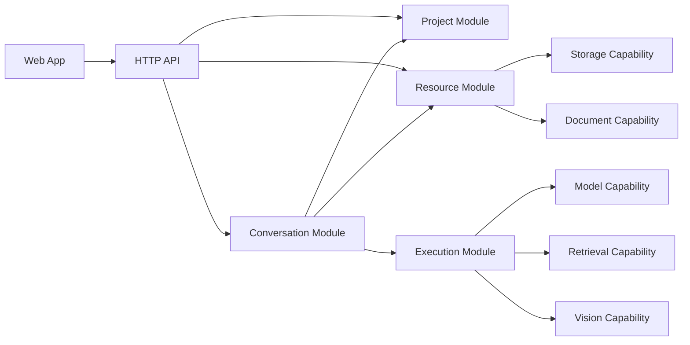
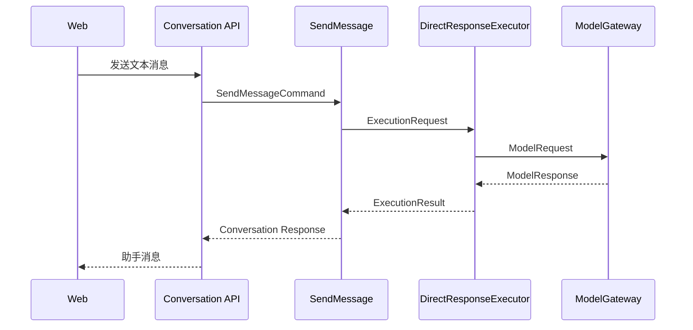

# qwen-demo 最终架构设计

> 状态：已确认  
> 适用范围：第一版及后续搜索、多模态、RAG、项目级上下文增量  
> 核心约束：后续允许新增代码和适配器，但不迁移既有模块、不反转依赖方向

具体框架和依赖版本策略见：[technology-stack.md](./technology-stack.md)。当前实施状态见：[development-progress.md](./development-progress.md)。

## 1. 架构目标

本项目是一个用于面试和 GitHub 展示的本地多模态 AI 工作台。架构需要同时满足：

- 第一版足够简单，可以快速完成文本问答和多轮会话闭环
- 后续可以增加联网搜索、附件理解、RAG 和 Agent 执行过程
- 业务边界从第一版开始保持稳定
- 外部模型、搜索、解析器和存储实现可以替换
- 不为了形式上的 DDD 制造空洞的聚合、服务和仓储
- 新增功能以扩展为主，不要求移动第一版代码

这里的“不改变结构”具体指：

- 不改变已经确认的顶层模块职责
- 不把已有类从一个业务模块迁移到另一个业务模块
- 不让领域层反向依赖框架、SDK 或数据库
- 允许在既有模块内部增加文件、子目录、用例和适配器
- 允许在预留的能力边界下增加新的供应商实现

## 2. 核心架构决策

### 2.1 总体形态

- 前端：独立 Web 应用
- 后端：独立 API 应用
- 部署：第一阶段本地部署
- 后端形态：模块化单体
- 业务建模：轻量 DDD
- 外部能力集成：端口适配器架构
- 复杂执行流：按需使用 LangGraph

模块化单体意味着代码按业务边界隔离，但后端仍以一个进程部署。当前阶段不采用微服务。

### 2.2 DDD 的使用范围

DDD 只用于存在业务状态、生命周期和规则的模块：

- `project`
- `conversation`
- `resource`
- `execution`

下面这些属于技术能力，不定义为限界上下文：

- 模型调用
- 联网搜索和知识检索
- 文档解析
- 图片理解
- 文件存储

它们统一放在 `capabilities` 下，通过契约和适配器接入。

### 2.3 分层不是目录仪式

业务模块可以包含以下四种职责：

- `domain`：实体、值对象、聚合和领域规则
- `application`：用例、事务边界和跨对象编排
- `infrastructure`：Repository、ORM、外部持久化实现
- `presentation`：HTTP Controller、请求响应 DTO

并非每个模块在第一天都必须有四个物理目录。目录在出现真实职责时创建；后续增加缺失目录属于扩展，不属于重构。

例如，`execution` 第一版没有独立 HTTP API，可以没有 `presentation`；只有出现查询、取消或重试 Run 的接口时才增加。

### 2.4 LangGraph 的位置

LangGraph 是执行流程的基础设施实现，不是领域模型，也不是整个系统的入口。

- 第一版直接模型问答不强制使用 LangGraph
- 搜索、附件和多步工具调用出现后，再增加 LangGraph 执行器
- LangGraph 代码只能位于 `execution/infrastructure`
- `conversation`、Controller 和领域对象不能依赖 LangGraph API

## 3. 总体架构



这张图表示应用层的协作方向，不表示聚合对象之间直接引用。跨模块关联统一使用 ID 或公开的应用层契约。

系统可以理解为三部分：

- 业务事实：项目、会话、消息、资源
- 执行过程：一次回答或 Agent Run 如何完成
- 技术能力：模型、检索、解析、视觉和存储

## 4. 稳定业务模块

### 4.1 Project

职责：

- 创建和管理项目
- 组织项目下的会话
- 保存项目级设置和元数据
- 后续承接项目级知识库配置与长期记忆策略

核心对象：

- `Project`：聚合根
- `ProjectSettings`：值对象
- `ProjectResourceRef`：项目与资源的关联引用

边界规则：

- `Project` 不加载 Conversation 或 Resource 实体
- 聚合内只保存相关对象 ID
- `Project` 不依赖 Agent、模型或检索能力

### 4.2 Conversation

职责：

- 创建和管理会话
- 保存用户消息与助手消息
- 维护消息顺序和会话状态
- 维护上下文摘要
- 保存回答引用
- 承载 `SendMessage` 主用例

核心对象：

- `Conversation`：聚合根
- `Message`：实体
- `ContextSummary`：值对象或独立持久化对象
- `Citation`：值对象
- `ResourceRef`：消息对资源的引用

边界规则：

- Conversation 保存 `projectId`，不持有 Project 实体
- Message 保存 `resourceId`，不持有 Resource 实体
- Conversation 负责“记住了什么”，不负责决定工具如何执行
- 模型返回值必须转换成领域可接受的数据后再写入聚合

### 4.3 Resource

`resource` 是比 `attachment` 更稳定的业务名称。界面上的“附件”是资源与消息的一种绑定方式；未来同一个资源还可以绑定到项目或知识库。

职责：

- 管理上传文件的元数据和生命周期
- 管理资源与消息、项目之间的绑定
- 记录解析状态和失败原因
- 管理原始文件与派生内容的引用

核心对象：

- `Resource`：聚合根
- `ResourceBinding`：实体或值对象
- `ResourceType`：值对象
- `ProcessingStatus`：值对象

边界规则：

- Resource 管文件事实和处理状态，不实现 PDF、DOCX 或图片模型调用
- 文件保存交给 `Storage` capability
- 文本提取和图片理解交给对应 capability
- 第一版没有附件功能时可以只保留边界，不实现完整聚合

### 4.4 Execution

职责：

- 提供稳定的回答执行入口
- 根据请求选择直接模型执行或多步 Agent 执行
- 后续记录 step、tool call、observation 和运行状态
- 承载 LangGraph 工作流实现

核心契约：

- `ResponseExecutor`
- `ExecutionRequest`
- `ExecutionResult`

需要持久化执行过程时，再引入：

- `AgentRun`：聚合根
- `AgentStep`
- `ToolInvocation`
- `Observation`
- `RunStatus`

边界规则：

- 第一版使用 `DirectResponseExecutor`
- 后续增加 `LangGraphResponseExecutor`
- Execution 接收 ID、上下文快照和资源描述，不接收 Conversation 聚合
- Execution 返回结果，不直接修改 Conversation
- Conversation 应用层负责把最终回答和引用写回会话

## 5. 技术能力

技术能力不套用 DDD 四层，只包含稳定契约、数据结构和适配器。

### 5.1 Model

契约：

- `ModelGateway`
- `ModelRequest`
- `ModelResponse`

适配器示例：

- `QwenModelAdapter`
- 后续可增加其他兼容模型适配器

### 5.2 Retrieval

`retrieval` 统一容纳外部信息检索，但明确区分两类契约：

- `WebSearchGateway`：联网搜索
- `KnowledgeRetriever`：项目知识库或向量检索

这样可以共享标准化结果结构，同时避免强行把网页搜索和向量检索做成完全相同的实现。

### 5.3 Document

契约：

- `DocumentExtractor`
- `DocumentContent`

适配器示例：

- `MarkdownExtractor`
- `PdfExtractor`
- `DocxExtractor`

文档摘要和问答属于 Execution 的用例流程；Document capability 只负责提取和标准化内容。

### 5.4 Vision

契约：

- `VisionAnalyzer`
- `VisionRequest`
- `VisionResult`

负责 OCR、图表、表格和一般图片理解的模型适配。

### 5.5 Storage

契约：

- `FileStorage`
- `StoredObject`

第一版可以使用本地文件系统适配器，未来可以增加对象存储适配器。

## 6. 最终目录结构

```text
qwen-demo/
├── apps/
│   ├── web/
│   │   └── src/
│   │       ├── app/
│   │       ├── features/
│   │       │   ├── project/
│   │       │   ├── conversation/
│   │       │   ├── composer/
│   │       │   ├── resource/
│   │       │   ├── execution/
│   │       │   └── citation/
│   │       ├── services/
│   │       └── shared/
│   │
│   └── server/
│       └── src/
│           ├── bootstrap/
│           │   ├── config
│           │   └── container
│           │
│           ├── modules/
│           │   ├── project/
│           │   │   ├── domain/
│           │   │   ├── application/
│           │   │   ├── infrastructure/
│           │   │   └── presentation/
│           │   │
│           │   ├── conversation/
│           │   │   ├── domain/
│           │   │   ├── application/
│           │   │   ├── infrastructure/
│           │   │   └── presentation/
│           │   │
│           │   ├── resource/
│           │   │   ├── domain/
│           │   │   ├── application/
│           │   │   ├── infrastructure/
│           │   │   └── presentation/
│           │   │
│           │   └── execution/
│           │       ├── domain/
│           │       ├── application/
│           │       └── infrastructure/
│           │           ├── executors/
│           │           └── workflows/
│           │
│           ├── capabilities/
│           │   ├── model/
│           │   │   ├── contract
│           │   │   └── adapters/
│           │   ├── retrieval/
│           │   │   ├── contract
│           │   │   └── adapters/
│           │   ├── document/
│           │   │   ├── contract
│           │   │   └── adapters/
│           │   ├── vision/
│           │   │   ├── contract
│           │   │   └── adapters/
│           │   └── storage/
│           │       ├── contract
│           │       └── adapters/
│           │
│           └── shared/
│
├── tests/
│   ├── unit/
│   ├── integration/
│   ├── contract/
│   └── architecture/
│
└── docs/
    ├── requirements.md
    └── architecture.md
```

目录图表达的是最终稳定槽位，不要求第一版创建所有空目录。语言和框架确定后，可以为文件补充对应扩展名，但模块边界不变。

`shared` 只允许存放真正稳定、无业务归属的内容，例如：

- ID 和时间基础类型
- 分页结构
- 通用错误基类
- 事件接口

业务 DTO、业务校验、模型请求和 Repository 不得为了“复用”放入 `shared`。

## 7. 核心用例与协作方式

### 7.1 SendMessage

`SendMessage` 位于 `conversation/application`，是聊天请求的唯一主入口。

```text
1. 校验项目和会话
2. 加载 Conversation
3. 追加用户消息
4. 获取上下文摘要和近期消息
5. 按 resourceId 获取本次资源描述
6. 构造 ExecutionRequest
7. 调用 ResponseExecutor
8. 将回答与 Citation 写回 Conversation
9. 持久化 Conversation
10. 返回响应 DTO
```

关键点：

- Controller 不直接调用模型
- Execution 不直接保存会话消息
- Conversation 不知道 LangGraph 的存在
- Resource 解析失败不会改变 Conversation 聚合边界

### 7.2 第一版执行流程



### 7.3 搜索阶段执行流程

保持 `SendMessage` 不变，只新增执行器和适配器：

```text
ResponseExecutor
└── LangGraphResponseExecutor
    ├── WebSearchGateway
    └── ModelGateway
```

### 7.4 多模态阶段执行流程

资源模块负责文件保存和确定性的文档文本提取，Execution 负责针对当前问题进行图片理解和回答编排：

```text
ResourceApplication
├── FileStorage
└── DocumentExtractor

LangGraphResponseExecutor
├── VisionAnalyzer
├── WebSearchGateway
└── ModelGateway
```

### 7.5 RAG 阶段执行流程

```text
LangGraphResponseExecutor
├── KnowledgeRetriever
├── WebSearchGateway
└── ModelGateway
```

## 8. 依赖规则

### 8.1 允许的依赖

- `presentation -> application`
- `application -> domain`
- `infrastructure -> application/domain contracts`
- `conversation.application -> project.application public API`
- `conversation.application -> resource.application public API`
- `conversation.application -> execution.application public API`
- `execution -> model/retrieval/vision capability contracts`
- `resource -> storage/document capability contracts`
- `bootstrap -> modules and adapters`

### 8.2 禁止的依赖

- Domain 依赖 HTTP、ORM、LangGraph 或供应商 SDK
- Controller 直接调用模型、搜索或数据库
- Conversation 聚合直接加载 Project、Resource 或 AgentRun 聚合
- Capability 反向依赖业务模块
- Execution 直接修改或持久化 Conversation
- LangGraph 类型出现在 Execution 之外的公共接口中
- 不同模块直接访问对方的 ORM Model 或数据库表
- 使用 `shared` 绕过模块边界

### 8.3 跨模块通信

模块化单体内部优先使用进程内应用服务，不提前引入消息队列。

- 同步查询：调用目标模块公开的 application query 接口
- 同步命令：调用目标模块公开的 application command 接口
- 非关键副作用：后续可以使用领域事件
- 跨聚合引用：只传 ID、不可变 DTO 或快照

## 9. 聚合与持久化原则

- 一个事务默认只修改一个聚合
- Repository 面向聚合根，不面向每张表
- ORM Model 与领域实体分离
- HTTP DTO 与领域实体分离
- 外部模型响应与领域对象分离
- Citation 作为助手消息的一部分持久化
- AgentRun 与 Conversation 分别持久化，通过 ID 关联
- Resource 原文件、元数据和解析结果可以分别存储

第一版可以使用关系型数据库和本地文件存储；具体数据库属于基础设施决策，不进入领域对象。

## 10. 稳定接口

从第一版开始必须稳定的核心接口包括：

- `ProjectRepository`
- `ConversationRepository`
- `ResponseExecutor`
- `ModelGateway`

功能出现时再增加：

- `ResourceRepository`
- `AgentRunRepository`
- `WebSearchGateway`
- `KnowledgeRetriever`
- `DocumentExtractor`
- `VisionAnalyzer`
- `FileStorage`

接口应表达项目需要的能力，而不是照搬供应商 SDK。

## 11. 分阶段落地

### 第一阶段：文本会话最小闭环

实现：

- 前后端基础框架
- Project 最小管理能力
- Conversation、Message 和会话历史
- `SendMessage`
- `DirectResponseExecutor`
- `ModelGateway` 与 Qwen 适配器
- 基础持久化

不引入：

- LangGraph
- 搜索
- 附件解析
- AgentRun 持久化

### 第二阶段：上下文管理

在 Conversation 内增加：

- 上下文窗口策略
- `ContextSummary`
- Token 统计
- 长会话压缩

### 第三阶段：联网搜索

在既有边界内增加：

- `WebSearchGateway`
- 搜索适配器
- `LangGraphResponseExecutor`
- Citation 标准化与展示
- 可选的 AgentRun 和步骤记录

### 第四阶段：图片和文档

在既有边界内增加：

- Resource 完整生命周期
- `FileStorage`
- `DocumentExtractor`
- `VisionAnalyzer`
- 资源与消息绑定
- 解析状态和错误处理

### 第五阶段：项目知识库与 RAG

在既有边界内增加：

- 资源与项目绑定
- 文档切块与索引
- `KnowledgeRetriever`
- 项目级上下文
- 长期记忆策略

整个演进过程中，第一阶段的 Controller、Conversation 聚合、`SendMessage` 主入口和 `ResponseExecutor` 调用方式保持不变。

## 12. 新增代码归属规则

本节是开发时的强制落位规范。新增功能不能先按技术名称建顶层目录，而应依次判断“谁拥有状态”“谁编排过程”“依赖什么外部能力”“由什么技术实现”。

### 12.1 四步落位法

每次新增代码时，按以下顺序判断：

1. **它是否描述长期业务事实或生命周期？**  
   是：放入拥有该事实的业务模块。项目归 `project`，消息与上下文归 `conversation`，文件与索引状态归 `resource`，执行记录归 `execution`。

2. **它是否描述一次用例或多步回答如何完成？**  
   普通业务用例放所属模块的 `application`；回答、工具选择和 Agent 流程放 `execution`。

3. **它是否提供可替换的通用技术能力？**  
   是：在 `capabilities/<能力>/contract` 定义内部契约和标准数据结构。

4. **它是否依赖具体框架、SDK、数据库或供应商？**  
   是：放入所属业务模块的 `infrastructure`，或对应 capability 的 `adapters`。

如果一段代码同时承担两种职责，应拆开。例如“搜索工具”拆成：

```text
execution/infrastructure/tools/web_search_tool
    → capabilities/retrieval/contract/web_search_gateway
        → capabilities/retrieval/adapters/<provider>
```

### 12.2 业务模块选择规则

| 新增内容描述的事实 | 所属模块 | 典型对象或用例 |
|---|---|---|
| 项目名称、设置、项目资源引用 | `project` | `Project`、`UpdateProjectSettings` |
| 会话、消息、摘要、引用、上下文窗口 | `conversation` | `Conversation`、`SendMessage`、`ContextSummary` |
| 文件元数据、绑定关系、解析与索引状态 | `resource` | `Resource`、`ProcessResource`、`IndexResource` |
| Run、Step、工具调用、Observation、执行状态 | `execution` | `AgentRun`、`ToolInvocation`、`ExecuteResponse` |

归属以“谁拥有和修改状态”为准，而不是以页面、API 路径或使用者为准。例如：

- 聊天页面上传文件，文件仍归 `resource`，不归 `conversation`
- 搜索结果用于回答，但工具调用记录归 `execution`，最终引用归 `conversation`
- 项目限定 RAG 范围，但向量查询能力不归 `project`

### 12.3 业务模块内部的分层规则

#### Domain

只有同时满足以下特征的代码才放入 `domain`：

- 表达业务概念、状态或不变量
- 不需要网络、文件、数据库或框架才能运行
- 可以用纯单元测试验证

可以放：

- 聚合根、实体和值对象
- 领域规则、状态迁移、领域事件
- 聚合 Repository 抽象，统一放在所属模块的 `domain/repositories`

不能放：

- HTTP DTO、ORM Model、SDK 类型
- LangGraph State、Prompt 模板加载器
- 数据库查询和模型调用

#### Application

负责完成一个用户用例或模块公开能力：

- Command、Query、Handler、Use Case
- 事务边界和跨聚合协调
- 面向其他模块的公开 API
- 应用服务和业务端口
- 将领域对象转换成结果 DTO

应用层可以决定调用顺序，但不能包含供应商 SDK 细节。

#### Infrastructure

负责业务模块端口的技术实现：

- Repository 和 ORM 映射
- 数据库查询
- LangGraph 工作流
- Tool 的框架包装
- 定时任务、事件发布实现
- 缓存、锁和事务管理器实现

#### Presentation

只负责传输协议边界：

- HTTP Controller/Router
- 请求和响应 DTO
- 参数校验、鉴权上下文读取
- SSE/WebSocket 协议适配
- 将异常映射成 HTTP 状态码

Presentation 不编排业务、不访问 Repository，也不直接调用 capability。

### 12.4 Capability 内部规则

每个 capability 只保留两类主要内容：

```text
capabilities/<name>/
├── contract/       # 内部稳定接口、请求响应类型、能力级错误
└── adapters/       # 具体供应商、SDK 或本地实现
```

规则如下：

- `contract` 使用项目自己的语言定义，不暴露供应商 SDK 类型
- 一个供应商或实现方式对应一个 Adapter
- Adapter 负责鉴权、重试、超时、限流映射和结果标准化
- Capability 不保存业务聚合状态
- Capability 不依赖 `project`、`conversation`、`resource` 或 `execution`
- 业务模块可以依赖 contract，但不能依赖具体 Adapter
- Adapter 的选择和装配只发生在 `bootstrap/container`

### 12.5 具体功能落位表

| 新增功能或对象 | 应放位置 | 不应放位置 |
|---|---|---|
| 创建、重命名、删除项目 | `modules/project/application` | Controller、`shared` |
| Project 业务规则 | `modules/project/domain` | ORM Model、前端状态 |
| 创建会话、发送消息 | `modules/conversation/application` | `execution`、模型 Adapter |
| Message、Citation | `modules/conversation/domain` | `capabilities/model` |
| 上下文窗口判断规则 | `modules/conversation/domain` | LangGraph workflow |
| 上下文组装、触发压缩 | `modules/conversation/application` | Controller |
| 基于模型的压缩实现 | `modules/conversation/infrastructure/compression` | Conversation 实体 |
| 上传、绑定、处理资源 | `modules/resource/application` | `conversation` |
| Resource、处理/索引状态 | `modules/resource/domain` | Document Adapter |
| 解析/索引任务实现 | `modules/resource/infrastructure` | Controller |
| 回答执行接口与请求结果 | `modules/execution/application` | Qwen Adapter |
| AgentRun、Step、ToolInvocation | `modules/execution/domain` | LangGraph State |
| Tool Registry、Tool Executor | `modules/execution/application` | 全局 `shared/tools` |
| LangGraph 图、节点和状态映射 | `modules/execution/infrastructure/workflows` | Conversation 或 Domain |
| Agent 可调用的工具包装 | `modules/execution/infrastructure/tools` | Capability contract |
| 模型接口和标准结果 | `capabilities/model/contract` | Conversation Domain |
| Qwen SDK 调用 | `capabilities/model/adapters` | Use Case、Controller |
| 网页搜索接口 | `capabilities/retrieval/contract` | Project Domain |
| 搜索供应商实现 | `capabilities/retrieval/adapters` | WebSearchTool |
| RAG 查询与写入接口 | `capabilities/retrieval/contract` | Resource 实体 |
| 向量库实现 | `capabilities/retrieval/adapters` | Execution Domain |
| PDF/DOCX/Markdown 提取接口 | `capabilities/document/contract` | Conversation |
| 具体解析库实现 | `capabilities/document/adapters` | Resource Domain |
| OCR/图片理解接口 | `capabilities/vision/contract` | Resource Domain |
| 具体视觉模型调用 | `capabilities/vision/adapters` | LangGraph Node |
| 文件保存接口 | `capabilities/storage/contract` | Resource 实体 |
| 本地/S3 文件实现 | `capabilities/storage/adapters` | Upload Controller |
| 配置、依赖注入、Adapter 选择 | `bootstrap` | Domain、Use Case |
| 通用 ID、时钟、分页、错误基类 | `shared` | 任意业务对象的临时复用代码 |

其他常见工程内容按以下规则放置：

- 数据库实体映射、Repository 实现和模块相关迁移：所属模块的 `infrastructure/persistence`
- 全局数据库连接、迁移执行器：`bootstrap`
- Agent 回答、工具选择 Prompt：`execution/infrastructure/prompts`
- 会话压缩 Prompt：`conversation/infrastructure/compression/prompts`
- 环境变量读取和配置校验：`bootstrap/config`
- 日志、Trace、Metric 的通用接口：`shared/observability`
- 具体可观测平台接入：`bootstrap` 或对应基础设施 Adapter
- 模块事件处理器：消费方模块的 `application/event_handlers`
- 定时任务入口：所属模块的 `infrastructure/jobs`，内部只调用 application use case

Prompt 按使用它的业务流程归属，不建立无边界的全局 `prompts` 目录。

### 12.6 工具新增规则

新增 Agent 工具必须区分“工具协议”和“真实能力”：

1. 工具名称、描述、参数 Schema 和结果映射放在 `execution/infrastructure/tools`
2. 工具注册、启停策略和调用入口放在 `execution/application`
3. 工具对应的外部能力接口放在相应 `capabilities/*/contract`
4. 供应商调用放在相应 `capabilities/*/adapters`
5. 调用过程需要持久化时，由 `execution` 创建 `ToolInvocation` 和 `Observation`

示例：

```text
新增“网页搜索工具”
├── execution/application/tool_registry
├── execution/infrastructure/tools/web_search_tool
├── capabilities/retrieval/contract/web_search_gateway
└── capabilities/retrieval/adapters/<search_provider>
```

纯内部计算且没有外部依赖的工具仍放在 `execution/infrastructure/tools`，不必创建 capability。例如日期计算或简单格式转换。

### 12.7 上下文压缩新增规则

上下文压缩的业务事实归 `conversation`：

```text
modules/conversation/
├── domain/
│   ├── context_summary
│   └── context_window_policy
├── application/
│   ├── context_assembler
│   └── compress_conversation
└── infrastructure/
    └── compression/model_context_compressor
```

- 何时压缩、保留多少近期消息：`conversation/domain`
- 选择消息、触发压缩、更新摘要：`conversation/application`
- 使用模型生成摘要：`conversation/infrastructure/compression`
- 实际模型请求：通过 `capabilities/model/contract`
- 摘要和覆盖的消息范围：作为 Conversation 的业务状态持久化

不得将压缩规则写入 LangGraph，也不得让 Conversation 实体直接调用模型。

### 12.8 检索与 RAG 新增规则

检索分成入库链路和查询链路。

入库链路由 `resource/application` 编排：

```text
Resource
→ FileStorage
→ DocumentExtractor
→ DocumentChunker
→ EmbeddingGateway
→ KnowledgeIndexer
→ 更新 Resource 索引状态
```

查询链路由 `execution` 编排：

```text
KnowledgeSearchTool
→ KnowledgeRetriever
→ VectorStoreAdapter
→ 标准化 RetrievalResult
→ ModelGateway
```

具体归属：

- 原文件、文档版本、解析和索引状态：`resource`
- 文档提取和切块接口：`capabilities/document`
- Embedding 接口：`capabilities/model`
- `KnowledgeIndexer`、`KnowledgeRetriever`：`capabilities/retrieval/contract`
- 向量数据库实现：`capabilities/retrieval/adapters`
- 是否检索、查询改写、结果融合：`execution`
- 最终来源引用：`conversation/domain/Citation`

`projectId` 只作为检索范围传入，`project` 模块不直接访问向量库。

### 12.9 流式输出新增规则

流式响应跨越多层，但每层只处理自己的职责：

- 流式模型契约和标准事件：`capabilities/model/contract`
- Qwen 流式 SDK 处理：`capabilities/model/adapters`
- 执行事件聚合和结束结果：`execution/application`
- SSE/WebSocket 编码、断连处理：`conversation/presentation`
- 最终完整消息持久化：`conversation/application`

传输层事件不得直接使用供应商 SDK 的 chunk 类型。

### 12.10 何时允许新增业务模块

只有一个概念同时满足大部分条件时，才新增 `modules/<name>`：

- 有独立且长期存在的业务身份和生命周期
- 有自己的状态、不变量和权限规则
- 有独立用例和持久化需求
- 不能自然归入现有四个模块
- 独立演进能降低而不是增加耦合

仅仅因为出现了一个 SDK、一张表、一类 API 或一个 LangGraph 节点，不得新增业务模块。

如果未来加入用户与权限，经过上述判断后可以新增 `identity`；这属于业务范围扩展。搜索供应商、向量数据库和 Prompt 管理通常不满足条件，不能因此新增顶层业务模块。

### 12.11 新增代码评审清单

每个新增功能在合并前至少确认：

- [ ] 状态的唯一拥有模块已经确定
- [ ] 领域代码不依赖框架、SDK、ORM 或网络
- [ ] Controller 没有直接调用 Repository 或 capability
- [ ] 跨模块只调用公开 application API 或 capability contract
- [ ] 聚合之间只通过 ID、DTO 或快照关联
- [ ] 供应商类型没有泄漏到 contract 和业务模块
- [ ] LangGraph 代码只存在于 `execution/infrastructure`
- [ ] 工具包装与真实能力实现已经分离
- [ ] `shared` 中没有业务专属代码
- [ ] 新增目录承载真实职责，不是为了凑齐四层
- [ ] 单元、集成、契约或架构测试已按风险补充

当一个文件无法通过这些规则确定唯一归属时，优先拆分职责，而不是把它放入 `shared`。

### 12.12 前端新增代码归属规则

前端按用户能力归入既有 feature：

| 新增界面能力 | 所属位置 |
|---|---|
| 项目列表、切换、设置 | `features/project` |
| 会话列表、消息展示、历史记录 | `features/conversation` |
| 输入框、搜索开关、发送状态 | `features/composer` |
| 上传、预览、解析状态 | `features/resource` |
| Agent 步骤、工具状态、停止或重试 | `features/execution` |
| 引用列表与来源跳转 | `features/citation` |
| HTTP/SSE/WebSocket 客户端 | `services` |
| 通用 UI、基础 Hook、无业务工具函数 | `shared` |
| 路由、Provider、全局装配 | `app` |

前端同样以状态归属为准：服务端 DTO 在 `services` 完成转换，feature 不直接依赖后端供应商格式；只有被至少两个 feature 稳定复用且不含业务语义的代码才能进入 `shared`。

## 13. 测试策略

- `unit`：领域规则、应用用例、上下文策略
- `integration`：数据库 Repository、文件存储、LangGraph 工作流
- `contract`：模型、搜索、解析器适配器是否满足内部契约
- `architecture`：自动检查禁止依赖和模块越界
- 前端测试按 feature 组织，重点覆盖消息发送、流式状态和引用展示

外部能力在单元测试中使用 Fake 或 Stub，不直接请求真实服务。

## 14. 最终结论

本项目最终采用：

- 模块化单体作为部署和代码组织方式
- `project`、`conversation`、`resource`、`execution` 作为稳定业务边界
- 轻量 DDD 管理有业务状态和规则的部分
- `capabilities` 管理模型、检索、文档、视觉和存储等技术能力
- `ResponseExecutor` 隔离简单问答与未来 LangGraph Agent 工作流
- 跨聚合只使用 ID、DTO 或快照协作
- 目录按真实职责逐步创建，但既有代码不跨模块迁移

这套设计保证第一版不会因过度设计而变重，同时让后续搜索、多模态和 RAG 都能在已经确定的边界内增量落地。
